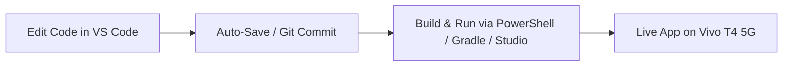

# 🚀 AuraDesk: Complete Mac-to-Windows Migration & Development Guide

This comprehensive, step-by-step guide covers everything you need to push the **AuraDesk** codebase to a new remote Git repository (GitHub/GitLab), clone and set it up on a **Windows machine**, and establish a high-efficiency **VS Code (Code Editing) + Android Studio / Terminal (Build & Run)** workflow.

---

## 📑 Table of Contents
1. [Part 1: Pushing Code from Mac to GitHub](#part-1-pushing-code-from-mac-to-github)
2. [Part 2: Windows Machine Environment Setup](#part-2-windows-machine-environment-setup)
3. [Part 3: Cloning the Repository on Windows](#part-3-cloning-the-repository-on-windows)
4. [Part 4: Android Studio Setup & Initial Build on Windows](#part-4-android-studio-setup--initial-build-on-windows)
5. [Part 5: Connecting Your Vivo T4 on Windows (Drivers & ADB)](#part-5-connecting-your-vivo-t4-on-windows-drivers--adb)
6. [Part 6: VS Code + Android Studio Workflow](#part-6-vs-code--android-studio-workflow)
7. [Part 7: 1-Click PowerShell Build & Run Scripts](#part-7-1-click-powershell-build--run-scripts)
8. [Part 8: Git Daily Sync Workflow](#part-8-git-daily-sync-workflow)
9. [Part 9: Windows-Specific Troubleshooting & FAQs](#part-9-windows-specific-troubleshooting--faqs)

---

## Part 1: Pushing Code from Mac to GitHub

The project has already been initialized with a clean Git repository and an initial commit containing all completed features (Phases 0 through 5).

### Step 1.1: Create a New Repository on GitHub
1. Open your browser and go to **[github.com/new](https://github.com/new)**.
2. Enter Repository Name: **`AuraDesk`** (or your preferred name).
3. Set Visibility: **Private** (or Public).
4. ⚠️ **IMPORTANT:** **DO NOT** check *"Add a README file"*, *"Add .gitignore"*, or *"Choose a license"*. Keep the repository completely empty.
5. Click **Create repository**.

### Step 1.2: Push the Code from Your Mac Terminal
Run the following commands in your Mac terminal inside the project directory:

```bash
# 1. Navigate to the project directory (if not already there)
cd /Users/sama/AndroidStudioProjects/AuraDesk

# 2. Add your new GitHub repository URL as origin
# (Replace YOUR_USERNAME and AuraDesk with your actual GitHub repo URL)
git remote add origin https://github.com/YOUR_USERNAME/AuraDesk.git

# 3. Rename branch to main (already done, but ensures consistency)
git branch -M main

# 4. Push all code and branches to GitHub
git push -u origin main
```

> **Note on Authentication:**
> When prompted for your password, enter your **GitHub Personal Access Token (PAT)** with `repo` permissions (not your account password), or use the GitHub CLI (`gh auth login`).

---

## Part 2: Windows Machine Environment Setup

Before cloning on Windows, install the necessary development tools:

### Step 2.1: Install Git for Windows
1. Download and install **[Git for Windows](https://git-scm.com/download/win)**.
2. During installation:
   - Choose default terminal / Bash options.
   - Under *"Configuring the line ending conversions"*, select **`Checkout as-is, commit Unix-style line endings`** (recommended for cross-platform Android projects).

### Step 2.2: Install Visual Studio Code
1. Download and install **[VS Code for Windows](https://code.visualstudio.com/)**.
2. Recommended Extensions for Android/Kotlin in VS Code:
   - **Kotlin** by *fwcd* (Language Server support)
   - **Kotlin Language Support** by *mathiasfrohlich* (Syntax highlighting)
   - **Android Theme / XML Tools**
   - **GitLens** by *GitKraken* (Git visualization)

### Step 2.3: Install Android Studio
1. Download and install **[Android Studio Ladybug / latest](https://developer.android.com/studio)**.
2. Standard installation includes:
   - Android SDK (Android 15 / API 35/37)
   - Android SDK Platform-Tools (`adb.exe`)
   - Android SDK Build-Tools
   - Bundled JetBrains Runtime (JBR / JDK 17/21)

### Step 2.4: Add Android SDK Platform-Tools to Windows PATH
1. Press `Win + S` and search for **Environment Variables** $\rightarrow$ click **"Edit the system environment variables"**.
2. Click **Environment Variables...** button.
3. Under **User variables**, select **`Path`** and click **Edit**.
4. Click **New** and add:
   ```text
   %LOCALAPPDATA%\Android\Sdk\platform-tools
   ```
   *(Default full path: `C:\Users\YOUR_WINDOWS_USERNAME\AppData\Local\Android\Sdk\platform-tools`)*
5. Click **OK** on all dialogs.
6. Open a new **PowerShell** window and verify:
   ```powershell
   adb version
   ```
   *(Should print `Android Debug Bridge version x.x.x`)*.

---

## Part 3: Cloning the Repository on Windows

### Step 3.1: Choose Your Project Workspace
Open **PowerShell** or **Git Bash** on Windows and create your project folder:

```powershell
# Create Projects directory (e.g., in C:\Users\<Username>\Projects or C:\AndroidStudioProjects)
mkdir -p C:\AndroidStudioProjects
cd C:\AndroidStudioProjects

# Clone the repository
git clone https://github.com/YOUR_USERNAME/AuraDesk.git

# Enter the project folder
cd AuraDesk
```

---

## Part 4: Android Studio Setup & Initial Build on Windows

### Step 4.1: Open the Project in Android Studio
1. Open **Android Studio**.
2. Click **Open** (or `File -> Open`).
3. Browse to `C:\AndroidStudioProjects\AuraDesk` and select the folder.
4. Android Studio will automatically start the initial Gradle sync.

### Step 4.2: Verify Gradle JDK
1. In Android Studio, go to:
   - `File` $\rightarrow$ `Settings` (or `Ctrl + Alt + S`).
   - Navigate to `Build, Execution, Deployment` $\rightarrow$ `Build Tools` $\rightarrow$ `Gradle`.
2. Under **Gradle JDK**, make sure **`Embedded JDK / JBR`** (version 17 or 21) is selected.
3. Click **Apply** and **OK**.

### Step 4.3: Test Build via Windows Terminal / PowerShell
Open terminal in `C:\AndroidStudioProjects\AuraDesk` and run:

```powershell
.\gradlew.bat assembleDebug
```

You should see: **`BUILD SUCCESSFUL in Xs`**!

---

## Part 5: Connecting Your Vivo T4 on Windows (Drivers & ADB)

### Step 5.1: Install USB Driver for Vivo / Snapdragon
1. When you connect your Vivo T4 to your Windows PC via USB cable:
   - In the phone's notification shade, select **`File Transfer / Android Auto`** (NOT "Charging only").
2. Windows will automatically configure the MTP / ADB interface.
3. If device is not recognized in Device Manager:
   - In Android Studio $\rightarrow$ `Tools` $\rightarrow$ `SDK Manager` $\rightarrow$ `SDK Tools` tab $\rightarrow$ Check **Google USB Driver** $\rightarrow$ Click **Apply**.
   - Alternatively, install the official Vivo USB driver from Vivo's official website.

### Step 5.2: Authorize ADB on Your Phone
1. In your Windows PowerShell:
   ```powershell
   adb devices
   ```
2. Look at your Vivo T4 phone screen:
   - You will see the prompt: **`"Allow USB debugging from this computer?"`**
   - Check **`"Always allow from this computer"`** and tap **`Allow`**.
3. Re-run `adb devices` $\rightarrow$ It should show:
   ```text
   10BG490UHC00DS7    device
   ```

### Step 5.3: Ensure Developer Options on Vivo T4
- **`USB Debugging`**: ON
- **`Install via USB`**: ON
- **`Verify apps over USB`**: OFF

---

## Part 6: VS Code + Android Studio Workflow

This setup gives you maximum developer speed: **lightweight fast code editing in VS Code, with reliable 1-click execution through Android Studio or Terminal.**



### How to use:
1. **Open Project in VS Code:**
   ```powershell
   cd C:\AndroidStudioProjects\AuraDesk
   code .
   ```
2. Edit any Kotlin file (e.g. `app/src/main/java/com/auradesk/guard/...`).
3. You have two options to run your app:

#### Option A: 1-Click Command Line (Inside VS Code Terminal `Ctrl + \``)
```powershell
# Build & Install directly to your connected Vivo T4
.\gradlew.bat assembleDebug
adb install -r app\build\outputs\apk\debug\app-debug.apk
adb shell am start -n com.auradesk.guard/.MainActivity
```

#### Option B: Keep Android Studio Open for 1-Click Run / Logcat
- Keep Android Studio open in the background.
- Whenever you make changes in VS Code, switch to Android Studio and click the green **`Run (▶️)`** button or press **`Shift + F10`**.
- View live logs in the **Logcat** tab filter: `tag:FaceDownDetector | tag:PersonRadarDetector | tag:DeepWorkDetector | tag:InterruptionRepository`.

---

## Part 7: 1-Click PowerShell Build & Run Scripts

To make testing instant, we have created a helper script for Windows PowerShell:

### Create `run_app.ps1` in Project Root:
```powershell
# run_app.ps1 - Quick Build, Install, and Launch Script
Write-Host "⚡ Building AuraDesk Debug APK..." -ForegroundColor Cyan
.\gradlew.bat assembleDebug

if ($LASTEXITCODE -eq 0) {
    Write-Host "📲 Installing to connected device..." -ForegroundColor Green
    adb install -r app\build\outputs\apk\debug\app-debug.apk
    
    Write-Host "🚀 Launching AuraDesk..." -ForegroundColor Green
    adb shell am start -n com.auradesk.guard/.MainActivity
} else {
    Write-Host "❌ Build Failed. Check Gradle logs above." -ForegroundColor Red
}
```

Now, inside VS Code terminal, simply run:
```powershell
.\run_app.ps1
```

---

## Part 8: Git Daily Sync Workflow

### When working on Windows (pushing changes):
```powershell
git add .
git commit -m "Your descriptive commit message"
git push origin main
```

### When updating from another machine:
```powershell
git pull origin main
```

---

## Part 9: Windows-Specific Troubleshooting & FAQs

### Q1: `gradlew.bat` gives "Execution failed for task ':app:compileDebugKotlin'"
- **Cause:** JDK version mismatch.
- **Fix:** Ensure `JAVA_HOME` points to JDK 17 or 21:
  ```powershell
  $env:JAVA_HOME = "C:\Program Files\Android\Android Studio\jbr"
  .\gradlew.bat assembleDebug
  ```

### Q2: Windows PowerShell says "running scripts is disabled on this system"
- **Cause:** Windows Execution Policy.
- **Fix:** Run PowerShell as Administrator and execute:
  ```powershell
  Set-ExecutionPolicy -ExecutionPolicy RemoteSigned -Scope CurrentUser
  ```

### Q3: `adb` is not recognized as an internal or external command
- **Fix:** Add `C:\Users\<YourUsername>\AppData\Local\Android\Sdk\platform-tools` to your System `PATH` variable, or run ADB directly:
  ```powershell
  & "$env:LOCALAPPDATA\Android\Sdk\platform-tools\adb.exe" devices
  ```

### Q4: Windows Defender Firewall blocks ADB
- **Fix:** When Windows pops up a Firewall dialog for `adb.exe`, check both **Private Networks** and **Public Networks** and click **Allow Access**.

---

### 🎉 Summary:
1. Push from Mac: `git remote add origin <URL>` $\rightarrow$ `git push -u origin main`.
2. Clone on Windows: `git clone <URL>`.
3. Open in VS Code for fast editing (`code .`).
4. Run via `.\run_app.ps1` or Android Studio's green ▶️ button!
