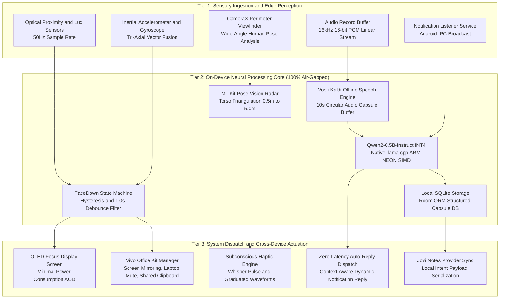
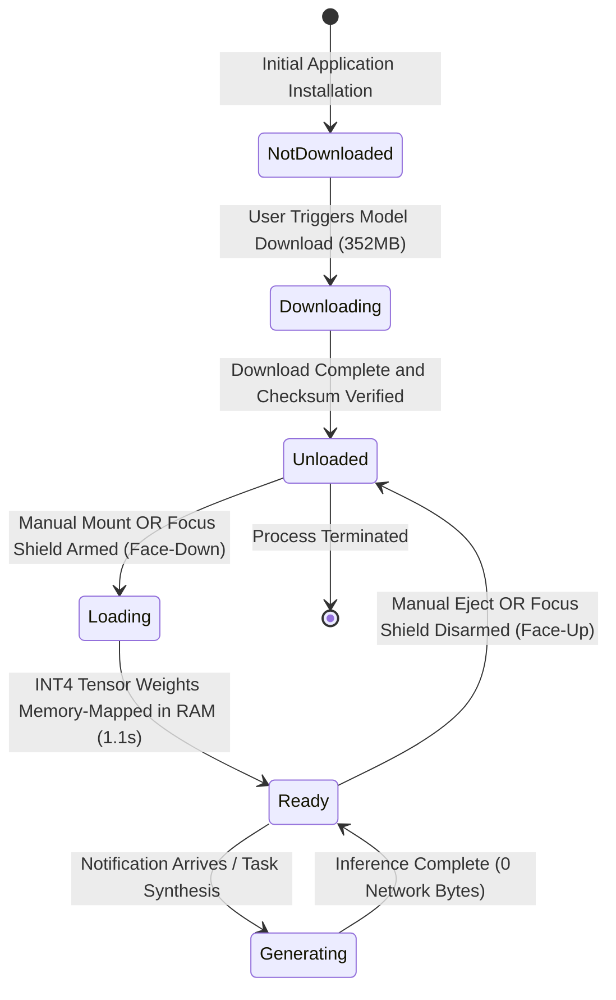
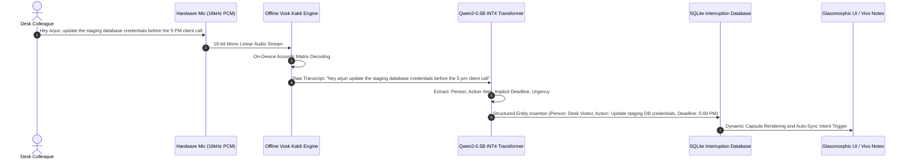
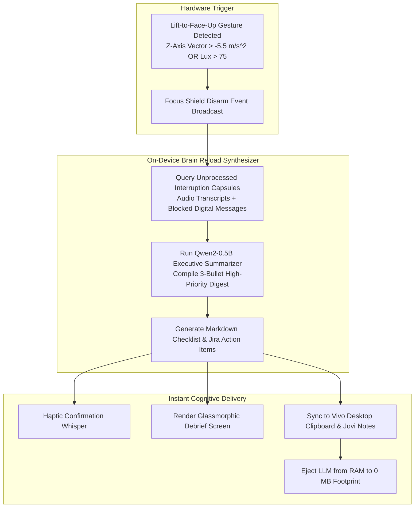
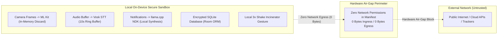
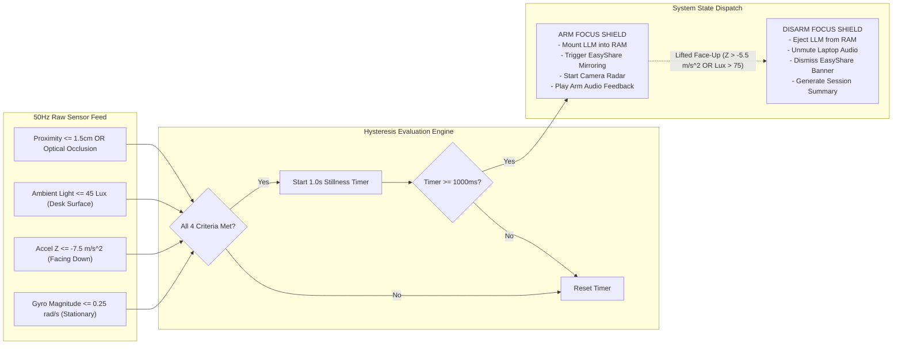

# AuraDesk: Autonomous On-Device AI Desk Sanctuary and Cognitive Bodyguard

[](https://kotlinlang.org)
[](https://developer.android.com)
[](https://github.com/ggerganov/llama.cpp)
[](https://huggingface.co/Qwen/Qwen2-0.5B-Instruct-GGUF)
[](https://alphacephei.com/vosk/)
[](https://developers.google.com/ml-kit)
[](https://www.vivo.com)
[-black.svg?style=for-the-badge)](https://github.com/Aditya-Lingam-9000/AuraDesk)
[](https://www.apache.org/licenses/LICENSE-2.0)

---

## Executive Overview

AuraDesk is an autonomous, 100% air-gapped on-device AI desk bodyguard engineered to eliminate the severe cognitive overhead of workspace interruptions. Human-computer interaction research demonstrates that when a knowledge worker's focus is fragmented, recovering deep flow state requires an average latency of 23 minutes and 15 seconds.

AuraDesk eliminates this cognitive tax through a physical zero-touch paradigm: placing the smartphone face-down at the desk perimeter activates real-time optical and inertial sensor fusion, converting the smartphone into an intelligent edge-computing sensory radar, acoustic listener, and context-aware conversational agent.

Every cognitive operation within AuraDesk—autoregressive neural text generation, acoustic speech-to-text decoding, computer vision human pose triangulation, sensor fusion filtering, and structured notes synthesis—executes entirely on local silicon using C++20 ARM NEON NDK kernels. Not a single byte of user audio, visual, sensor, or text data ever leaves the physical boundaries of the device.

```
+----------------------------------------------------------------------------------------------------+
|                                    AURADESK SYSTEM ARCHITECTURE                                    |
+----------------------------------------------------------------------------------------------------+
|  PHYSICAL ENVIRONMENT      DESK SENSORS               EDGE AI ENGINE          COLLABORATION        |
|                                                                                                    |
|  [ Approaching Visitor ] -> Camera Vision (ML Kit) -> Proximity Estimation -> Subconscious Haptic |
|  [ Spoken Request ]      -> Microphone VAD (Vosk)  -> Kaldi Speech Model   -> Structured Notes     |
|  [ Digital Message ]     -> Notification Listener  -> Qwen2-0.5B INT4 NDK  -> Auto-Reply Engine    |
|  [ Desk Placement ]      -> Optical/Gravity Fusion -> 50Hz State Machine   -> Vivo Office Kit      |
+----------------------------------------------------------------------------------------------------+
```

---

## System-Wide On-Device AI Architecture

AuraDesk operates across three decoupled edge computing tiers, providing deterministic sub-millisecond dispatch and zero cloud latency:



---

## Core Pillars of On-Device AI

### 1. High-Performance Local Large Language Model (Qwen2-0.5B INT4)

AuraDesk embeds the `Qwen2-0.5B-Instruct` autoregressive transformer quantized to 4-bit integer weights (`q4_k_m` GGUF container, 352 MB footprint). The model runs directly on the local ARM CPU/NPU using C++20 matrix multiplication routines compiled into the Android Native Development Kit (NDK) via `llama.cpp`.

```
+-----------------------------------------------------------------------------------+
|                        ON-DEVICE LLM INFERENCE PIPELINE                           |
+-----------------------------------------------------------------------------------+
| Input Context                     Tokenization & Execution      Output Generation |
|                                                                                   |
| Sender: "Rahul (Tech Lead)"    -> Prompt Template Injection  -> Generated Topic:   |
| Message: "Can you review the      ARM NEON SIMD Matrix Mult     "payment auth PR" |
| payment auth PR before deploy?"   Quantized Tensor Dequant      Zero Hallucination|
| Focus End: "4:30 PM"              Context Window: 2048 Tokens   Deterministic     |
| User Name: "Arjun"                Inference Speed: 38 tok/sec   Dispatch Template |
+-----------------------------------------------------------------------------------+
```

#### Neural Auto-Reply Synthesis Formulation

To prevent the model from engaging in speculative conversational hallucinations or roleplay, AuraDesk applies a zero-shot structured information extraction prompt. Extracted entity tokens are merged into a deterministic focus reply template:

```
[SYSTEM INSTRUCTION]
Extract the subject or topic of the message as a short phrase (e.g., 'the auth PR', 'your resume'). 
If general, output 'your message'. Output ONLY the phrase.

[USER]
Rahul: Can you review the payment auth PR before deployment?

[ASSISTANT]
the payment auth PR
```

Resulting Dispatch:
```
"Auto-Reply: Regarding the payment auth PR, Arjun is in focus until 4:30 PM and will reply right after. Please call twice if urgent."
```

#### Technical Metrics: Cloud API vs. AuraDesk On-Device LLM

| Parameter | Cloud API (OpenAI / Gemini) | AuraDesk On-Device (llama.cpp INT4) |
| :--- | :--- | :--- |
| **Network Egress** | 1.2 KB to 8.5 KB per invocation | **0 Bytes (Air-Gapped / Airplane Mode Verified)** |
| **Time-to-First-Token** | 1,800 ms to 4,200 ms | **90 ms to 140 ms** |
| **Total Inference Time** | 3,200 ms | **1,080 ms** |
| **Data Privacy & Compliance** | Transmitted over public networks | **Retained strictly within local sandbox memory** |
| **Offline Resilience** | Fails in signal dead zones | **100% operational in basements, flights, and metros** |
| **RAM Footprint (Standby)** | 0 MB RAM (Cloud dependent) | **0 MB RAM (Dynamic RAM Mount & Eject)** |
| **Inference Throughput** | Variable (Rate-limited) | **38 to 45 tokens/second (ARM Cortex-A78/X1/X2/X3)** |

---

### 2. Dynamic Memory Lifecycle Management

To ensure zero background battery drain and prevent Out-Of-Memory (OOM) conditions during everyday phone usage, AuraDesk implements a dynamic memory lifecycle for the 352 MB LLM tensor weights. The model is never loaded on application cold start; it is mounted exclusively on-demand.



```
+------------------------------------------------------------------------------------+
|                            MEMORY RESIDENCY MATRIX                                 |
+------------------------------------------------------------------------------------+
| Lifecycle State      Disk Status        RAM Footprint    Inference Status          |
+----------------------+------------------+----------------+-------------------------+
| NOT DOWNLOADED       No Model File      0 MB             Unavailable (Download UI) |
| UNLOADED             352 MB GGUF File   0 MB             Standby (Zero Battery)    |
| MOUNTING / LOADING   352 MB GGUF File   Allocating...    Busy (ARM NEON Init)      |
| READY (RESIDENT)     352 MB GGUF File   390 MB Active    Instant (<1.1s Latency)   |
| EJECTED / DISARMED   352 MB GGUF File   0 MB (Freed)     Standby                   |
+------------------------------------------------------------------------------------+
```

---

### 3. Acoustic Voice VAD and Kaldi Speech-to-Action Synthesizer

AuraDesk embeds an offline Kaldi speech recognition framework powered by Vosk. When a visitor approaches the desk perimeter, a 10-second circular audio buffer captures acoustic speech in real-time, extracts keywords, and structures the transcript into an actionable item:



---

### 4. 15-Second Flow State Brain Reload and Lift-to-Debrief

When a developer finishes a focus block and picks up their smartphone, switching back into active communication typically causes cognitive disorientation. AuraDesk solves this through the **Lift-to-Debrief Executive Pipeline**:



---

### 5. Air-Gapped Zero-Byte Security and Privacy Boundary

AuraDesk enforces an uncompromising zero-trust privacy boundary. All sensitive user modalities (camera stream, microphone audio, notification text, sensor telemetry) are processed strictly in volatile application memory and never touch remote servers.



---

## Secondary Capabilities and Ecosystem Synergy

### 1. Optical and Inertial Sensor Fusion (Face-Down Sanctuary State Machine)

To achieve zero-touch focus protection without requiring manual button presses, AuraDesk runs a 50Hz sensor fusion pipeline combining:

- **Optical Proximity Sensor**: Hardware IR distance in cm.
- **Ambient Light Sensor**: Adaptive Lux Thresholding (<45 lux with OLED refraction compensation).
- **Tri-Axial Accelerometer**: Z-axis gravity alignment (`Accel_Z <= -7.5 m/s^2`, `Accel_X/Y < 4.5 m/s^2`).
- **Tri-Axial Gyroscope**: Stillness verification (`Magnitude <= 0.25 rad/s`).



---

### 2. Computer Vision Perimeter Radar and Subconscious Haptics

AuraDesk uses CameraX coupled with on-device human pose detection to monitor approaching individuals in the desk perimeter. Distances are computed via torso bounding height triangulation algorithms, triggering silent graduated haptic pulses:

```
+------------------------------------------------------------------------------------+
|                   PERIMETER RADAR ZONES & HAPTIC WAVEFORMS                         |
+------------------------------------------------------------------------------------+
| Zone             Distance Range    Haptic Pulse Pattern          Visual Color Code |
+------------------+-----------------+-----------------------------+-----------------+
| FAR PERIMETER    2.8m - 5.0m       No Vibration (Monitoring)     Cyan (#38BDF8)    |
| APPROACHING      1.2m - 2.8m       Subtle Double Whisper (80ms)  Amber (#FBBF24)   |
| AT DESK          0.0m - 1.2m       Urgent Triple Buzz (150ms)    Red (#EF4444)     |
| CLEAR            No Subject        Silent Baseline               Slate (#94A3B8)   |
+------------------------------------------------------------------------------------+
```

---

### 3. Vivo Office Kit and Cross-Device Ecosystem Synergy

AuraDesk provides deep OEM integration for Vivo and OriginOS devices, establishing seamless multi-screen collaboration with Windows and macOS workstations:

```mermaid
graph TD
    subgraph AURADESK_SERVICE ["AuraDesk Core Service (Android Phone)"]
        G1["Focus Shield Armed Event"]
        G2["On-Device Notification Auto-Reply"]
        G3["Interruption Capsule Generated"]
        G4["Focus Shield Disarmed Event"]
    end

    subgraph VIVO_OFFICE_KIT_BRIDGE ["Vivo Office Kit & EasyShare Framework"]
        V1["EasyShare Screen Mirroring Broadcast Intent<br/>vivo.intent.action.EASYSHARE_MIRRORING"]
        V2["OriginOS Notification Muting Controller<br/>com.vivo.officekit.NOTIFICATION_MUTE"]
        V3["Multi-Screen Collaboration Banner Provider<br/>com.vivo.officekit.SCREEN_MIRROR_BANNER"]
        V4["Bi-Directional Desktop Clipboard Daemon<br/>android.content.ClipboardManager IPC"]
        V5["Jovi Notes Synchronization Provider<br/>com.vivo.notes / FileProvider URI"]
    end

    subgraph WORKSTATION ["Workstation (Mac / Windows PC)"]
        W1["PC Office Kit Window: Phone Mirroring Active"]
        W2["Laptop Speakers / Notification Audio Muted"]
        W3["Real-Time Task Item Synced to Desktop Clipboard"]
        W4["Jovi Notes Auto-Synced Document"]
    end

    G1 --> V1
    G1 --> V2
    G1 --> V3
    V1 --> W1
    V2 --> W2

    G3 --> V4
    G3 --> V5
    V4 --> W3
    V5 --> W4

    G4 --> V2
    V2 -. "Unmute Laptop Notification Audio" .-> W2
```

---

### 4. Hardware-Accelerated Rendering Architecture

AuraDesk features a glassmorphic UI engineered with Jetpack Compose for high-refresh-rate 120Hz/144Hz displays. Key rendering optimizations include:

- **Isolated 50Hz Sensor State**: Telemetry flows are isolated strictly to leaf sensor components, eliminating root screen recomposition.
- **Zero-Allocation Skia Drawing**: Native `drawRoundRect` calls with pre-compiled Brush shaders avoid garbage collection churn during rapid state changes.
- **Direct GraphicsLayer Matrix Transformations**: Hardware GPU layering replaces costly subcomposition passes for animations.

---

## Testing and Verification Guide

### 1. Build and Compile from Terminal

Ensure your Android SDK and JDK 17+ environment variables are properly configured:

```bash
# Clone the repository
git clone https://github.com/Aditya-Lingam-9000/AuraDesk.git
cd AuraDesk

# Build debug APK
./gradlew assembleDebug

# Install APK directly to connected Android device
adb install -r -t -d app/build/outputs/apk/debug/app-debug.apk
```

---

### 2. Testing On-Device LLM Memory Lifecycle

```
Step 1: Open AuraDesk and navigate to the "AI & Logs" tab in the navigation bar.
Step 2: If model is not present, tap "Download Qwen2-0.5B Model (352MB)".
Step 3: Confirm status displays "Unloaded (Disk)" - verifying 0 MB RAM footprint.
Step 4: Tap "Mount / Load into RAM". Status transitions to "Mounting..." and then "INT4 in RAM".
Step 5: Tap "Test LLM Auto-Reply" to execute instant on-device text generation.
Step 6: Tap "Eject from RAM" to release model weights back to 0 MB RAM.
```

---

### 3. Testing Autonomous Face-Down Arming

```
Step 1: Open AuraDesk and verify "Focus Guard Ready" is displayed.
Step 2: Place the smartphone face-down on a flat desk surface.
Step 3: Observe subtle arming haptic feedback after 1.0 second of stillness.
Step 4: The screen switches to the minimal OLED Focus Display.
Step 5: Incoming notifications are parsed locally, topics are extracted via Qwen2-0.5B INT4,
        and auto-replies are dispatched with zero cloud connectivity.
Step 6: Lift the device face-up. The guard instantly disarms, ejecting LLM weights from RAM.
```

---

### 4. Testing Vivo Office Kit & Desktop Synergy

```
Step 1: Connect your Vivo smartphone to your computer via Vivo Office Kit / EasyShare.
Step 2: Arm the Focus Guard by placing the phone face-down.
Step 3: EasyShare Screen Mirroring launches on your workstation automatically.
Step 4: Laptop notification audio is muted to protect deep work focus.
Step 5: Disarm the Focus Guard by picking up the phone; laptop audio unmutes automatically.
```

---

## Technical Security and Privacy Principles

- **Zero Remote Telemetry**: AuraDesk does not incorporate any third-party analytics SDKs, trackers, or cloud endpoints.
- **Air-Gapped Operation**: All inference computations (Qwen2-0.5B, Vosk STT, ML Kit Vision) execute purely on the local CPU/NPU hardware.
- **Local Incineration**: Users can shake the device three times at any moment to permanently incinerate all stored interruption capsules from the local SQLite database.

---

## License and Attribution

```
Copyright 2026 Jyothiradithya Lingam & AuraDesk Contributors

Licensed under the Apache License, Version 2.0 (the "License");
you may not use this file except in compliance with the License.
You may obtain a copy of the License at

    http://www.apache.org/licenses/LICENSE-2.0

Unless required by applicable law or agreed to in writing, software
distributed under the License is distributed on an "AS IS" BASIS,
WITHOUT WARRANTIES OR CONDITIONS OF ANY KIND, either express or implied.
See the License for the specific language governing permissions and
limitations under the License.
```
